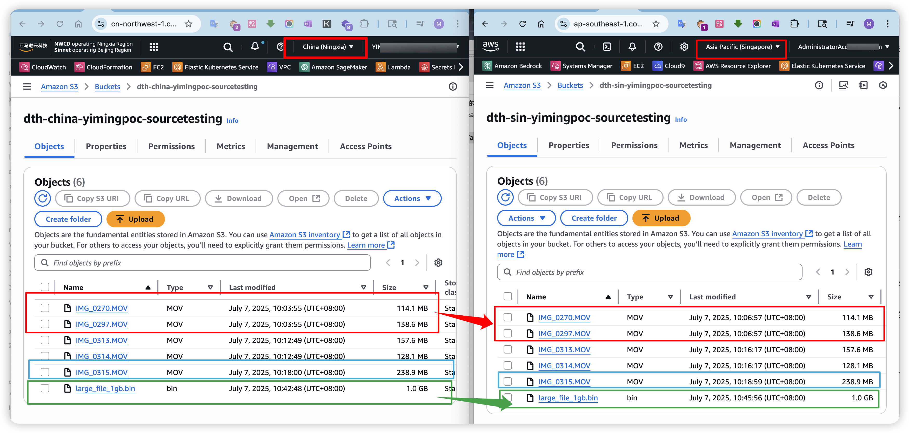
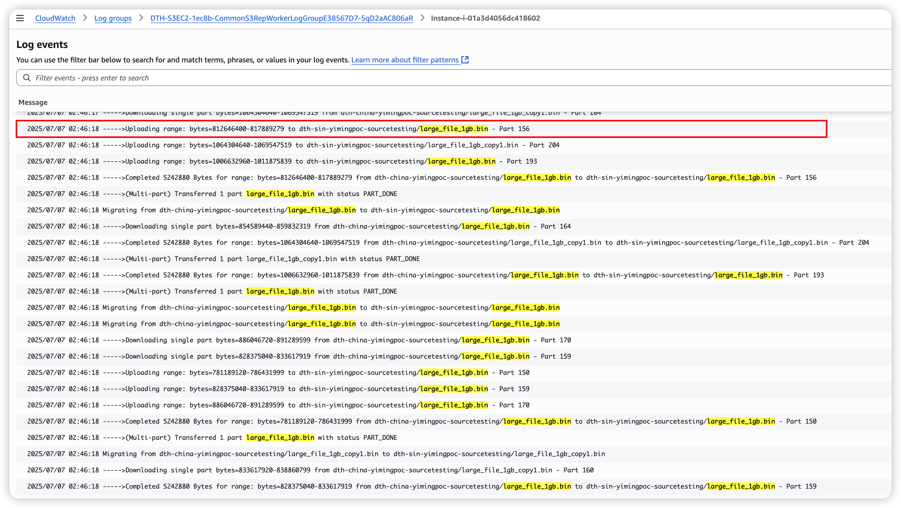
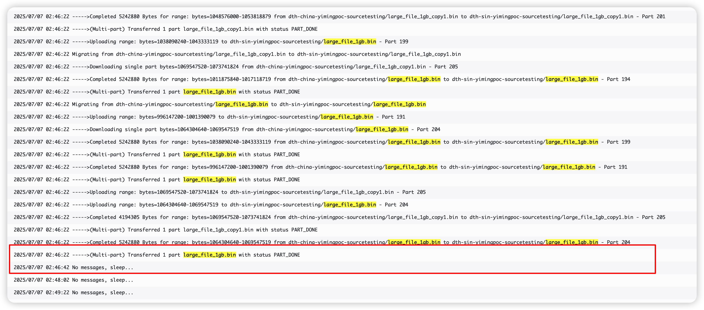
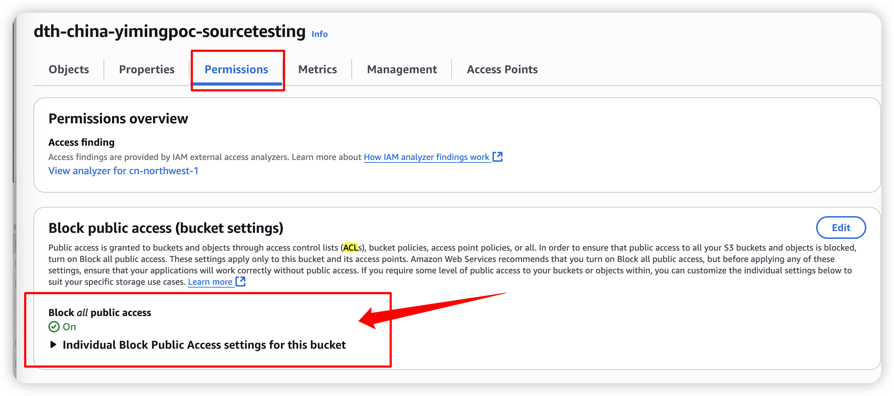
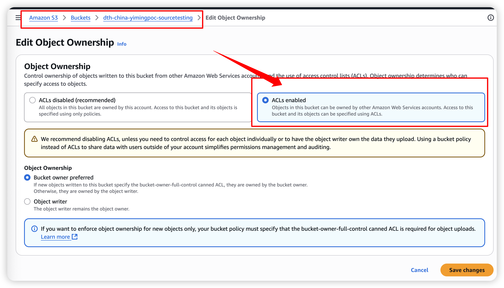
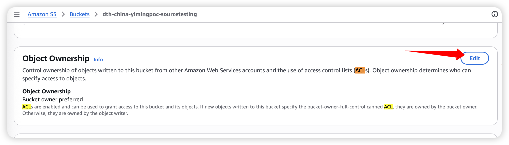
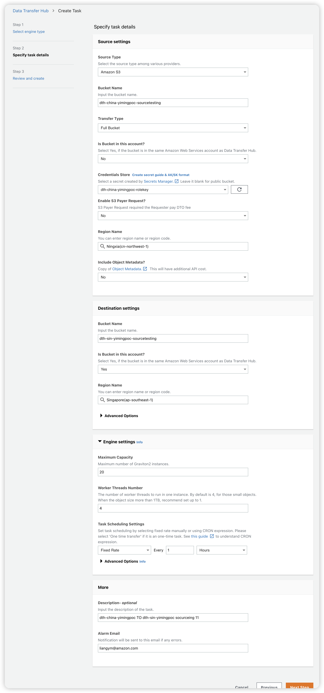
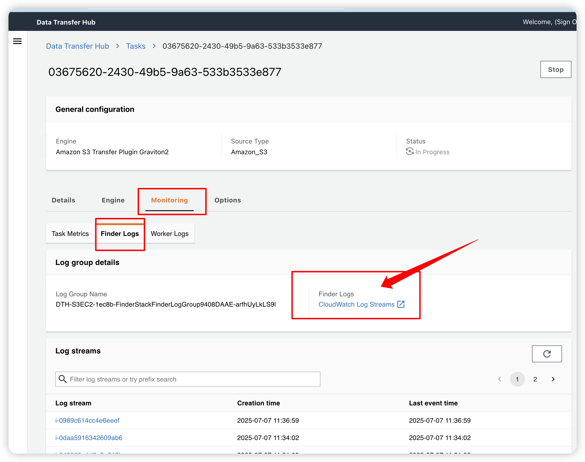
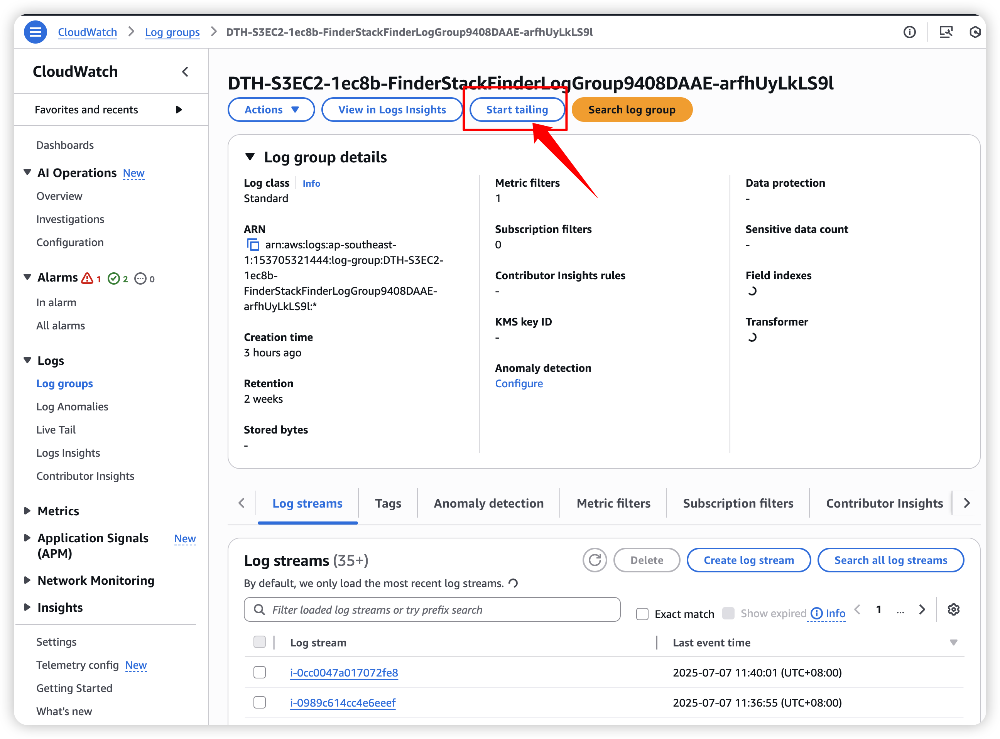

# DataTransferHub-Solution-s-Actual-Test-Results-and-Installation-Instructions2
DataTransferHub Solution's Actual Test Results and Installation Instructions, Scenario: S3 Bucket Mirror Replication Transmission between China and Singapore (Updated in 2025) DataTransferHub方案的实测结果与安装说明，场景为中国与新加坡的S3桶镜像复制传输（2025年更新）

## DataTransferHub方案的实测结果与安装说明，场景为中国与新加坡的S3桶镜像复制传输（2025年更新）

### 一、业务场景要求

1. 需要时将Amazon S3中存储的数据从 宁夏（cn-northwest-1） 传输到 新加坡（ap-southeast-1） ；
2. 支持增量数据传输；支持大文件；
3. 对传输时间有时效性的要求，希望尽可能传输的快；
4. 传输之后有数据校验功能确保数据传输的完整性；
5. 支持反向传输Amazon S3文件；

### 二、DataTransferHub方案关键技术点是如何满足上面的业务场景

1. 使用了互联网公网来传输，避免了专线的高额费用；
2. 传输过程中启用BBR以提高网络性能；
3. 实际采用了EC2高弹性+自动扩展的传输方式，传输开始如是大文件先打成小的片段，再动态启动多台EC2用几百个线程进行文件的传输（走公网），线程传输结束后再组合为大文件，经过MD5校验成功后传输成功。 多台EC2会动态关闭；
4. 支持 自动重试和错误处理，提供Cloudwatch仪表板以监控进度和指标

### 三、实测结果

1. 请看图 - 增量文件，将Amazon S3中存储的数据从 宁夏（cn-northwest-1） 传输到 新加坡（ap-southeast-1） 
2. 从几百兆到1GB的文件，单个文件的复制任务完成时间为1-3分钟；
3. 文件复制时间取决于任务的轮询周期（最少设置为2分钟检查一遍源头有无增加） + 互联网公网复制的时间；

4. **互联网公网复制效率为 1GB 文件 大约1分钟（下图）**

### 四、部署教程

**请注意，本次业务需求是部署在新加坡区域（请看业务需求）**

- CloudFormation在这里  [**DataTransferHub-cognito.template]**：https://docs.aws.amazon.com/zh_cn/solutions/latest/data-transfer-hub/aws-cloudformation-template.html
- 参考教程：[将Amazon S3 的数据从北京 (cn-north-1) 传输到 俄勒冈州(us-west-2)](https://github.com/aws-solutions-library-samples/data-transfer-hub/blob/main/docs/tutorial-beijing-to-oregon-s3_CN.md)
- Data Transfer Hub 用户指南：https://github.com/aws-solutions-library-samples/data-transfer-hub/blob/main/docs/UserManual_CN.md
- Github官网：https://github.com/aws-solutions-library-samples/data-transfer-hub/blob/main/README.md

### 五、部署需要注意的关键点（2025更新，确保能正常工作）

1. Amazon S3 桶全部是私有桶，不应该对外公开，确保 为初始状态 = Block all public access

2. Amazon S3 源桶在中国区（ZHY），这个桶一定开启 ACL。 不开启的话，DTH会报错 ListObject Error；

3. DTH的任务配置参考（这个好用）

4. DTH的任务观察和troubleshooting的最佳方式：

### 六、结束
